# ProDream

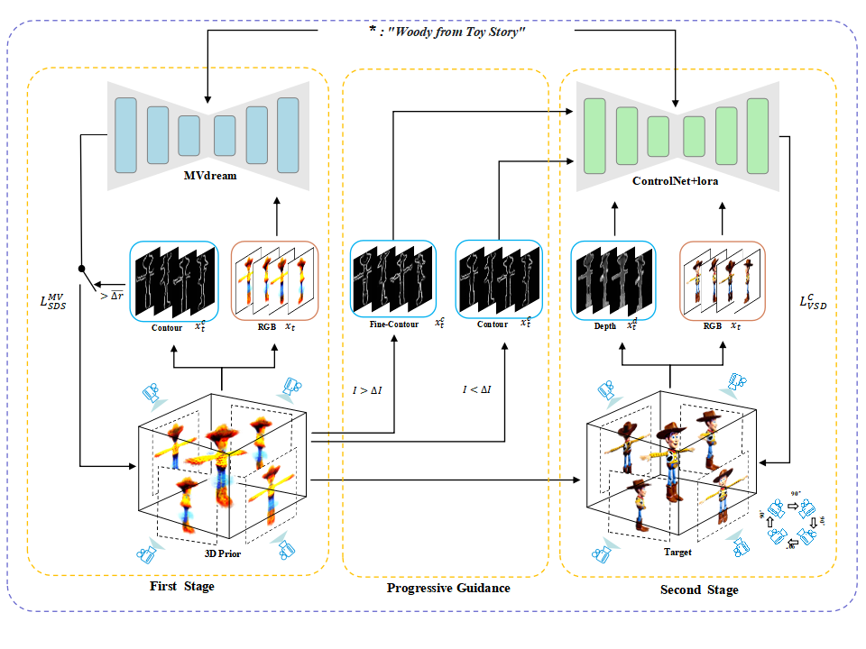 
 
<em>Pipeline of ProDream.</em>

## TODO

- [x] **Part I: Release of Prompts and 3D Assets**  
  Open-source all text prompts and generated NeRF assets (multi-view dynamic renders in GIF format).
- [ ]  **Part II: Open-Source Core Framework Implementation** 

## Examples
<table class="center">
<tr>
  <td width=20% align="center"></td>
  <td width=20% align="center"></td>
  <td width=20% align="center">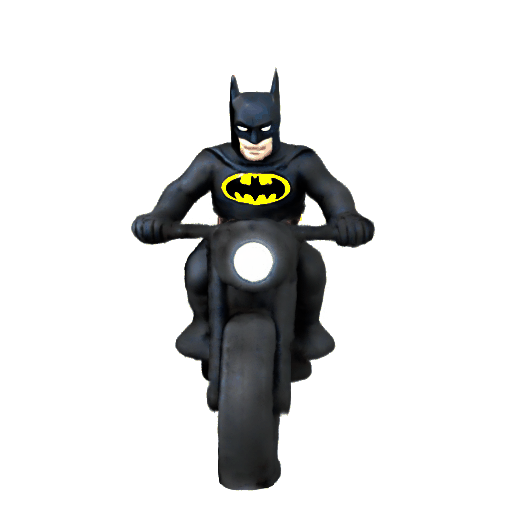</td>
  <td width=20% align="center">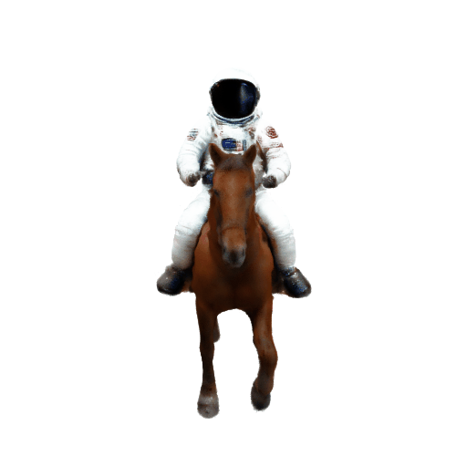</td>
  <td width=20% align="center">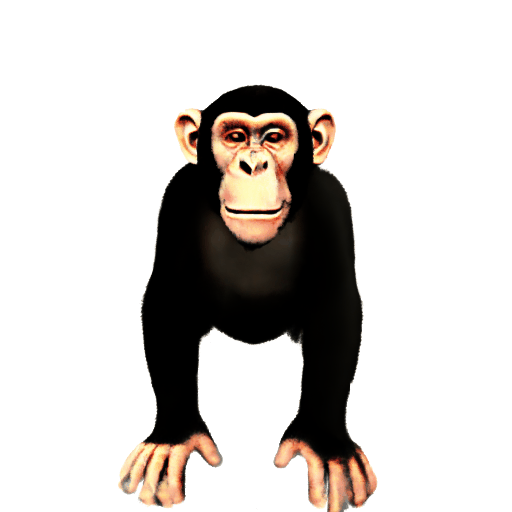</td>
</tr>
<tr>
  <td width=20% align="center">"Lionel Messi in a suit, holding the Ballon d'Or"</td>
  <td width=20% align="center">"Elon musk, using a laptop"</td>
  <td width=20% align="center">"Batman is riding a moto"</td>
  <td width=20% align="center">"An astronaut is riding a horse"</td>
  <td width=20% align="center">"A chimpanzee dressed like Henry VIII king of England"</td>
</tr>
<tr>
  <td width=20% align="center"></td>
  <td width=20% align="center">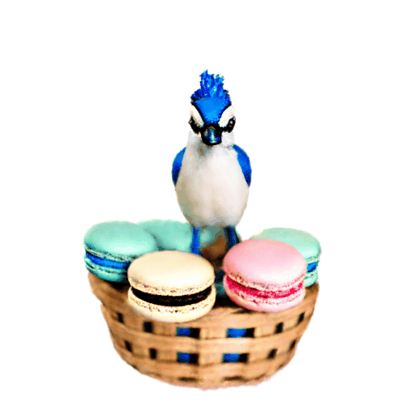</td>
  <td width=20% align="center">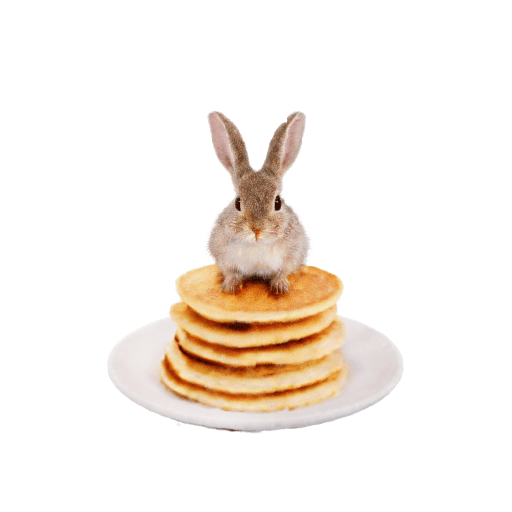</td>
  <td width=20% align="center">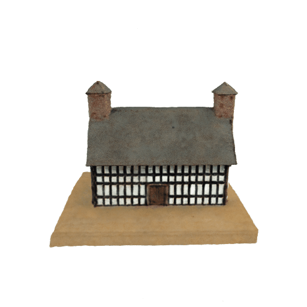</td>
  <td width=20% align="center">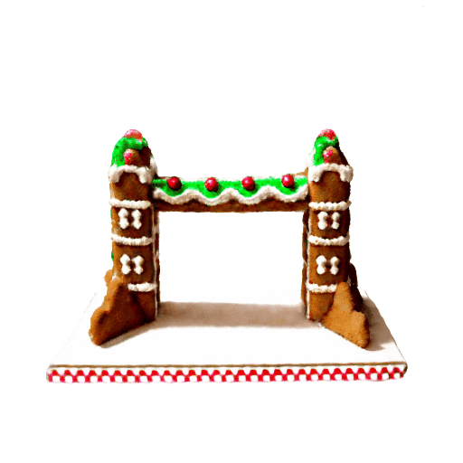</td>
</tr>
<tr>
  <td width=20% align="center">"Michelangelo style statue of dog reading news on a cellphone"</td>
  <td width=20% align="center">"A blue jay standing on a large basket of rainbow macarons"</td>
  <td width=20% align="center">"A baby bunny sitting on top of a stack of pancakes"</td>
  <td width=20% align="center">"A model of a house in Tudor style"</td>
  <td width=20% align="center">"Tower Bridge made out of gingerbread and candy"</td>
</tr>
<tr>
  <td width=20% align="center">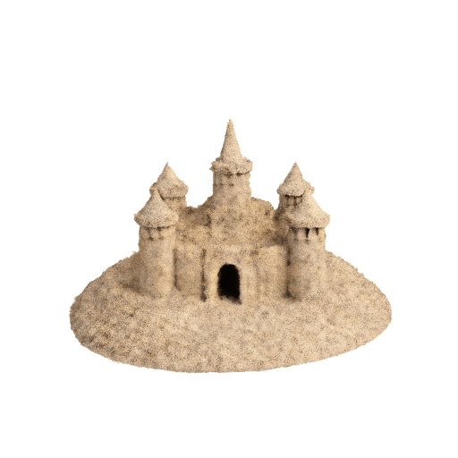</td>
  <td width=20% align="center"></td>
  <td width=20% align="center">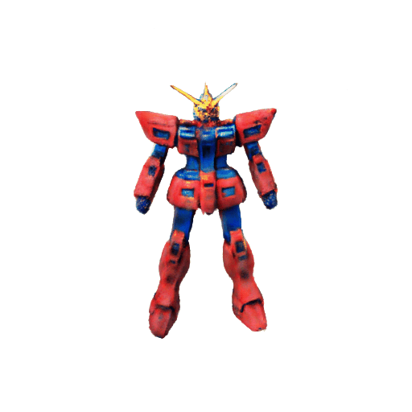</td>
  <td width=20% align="center">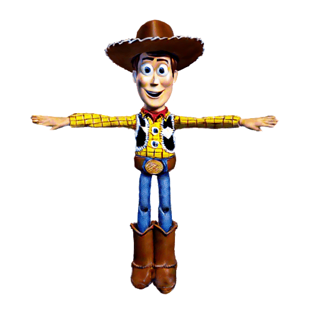</td>
  <td width=20% align="center">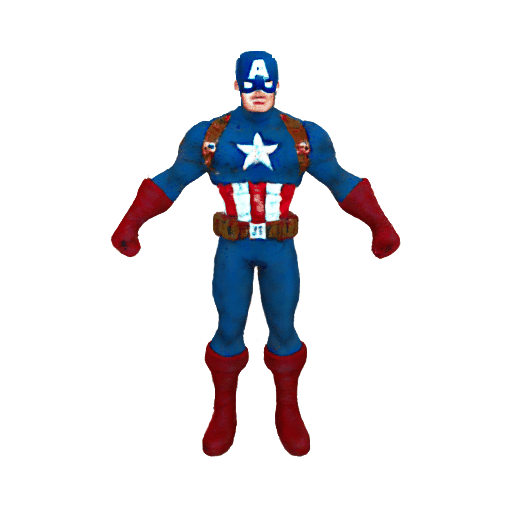</td>
</tr>
<tr>
  <td width=20% align="center">"A highly detailed sand castle"</td>
  <td width=20% align="center">"A pavilion in a Chinese garden"</td>
  <td width=20% align="center">"A gundam"</td>
  <td width=20% align="center">"Woody from Toy Story"</td>
  <td width=20% align="center">"Captain America"</td>
</tr>
<tr>
  <td width=20% align="center">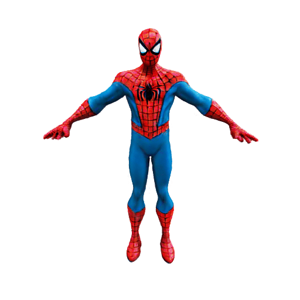</td>
  <td width=20% align="center">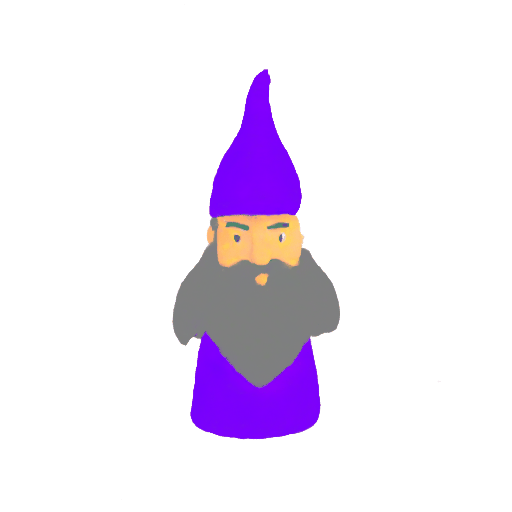</td>
  <td width=20% align="center">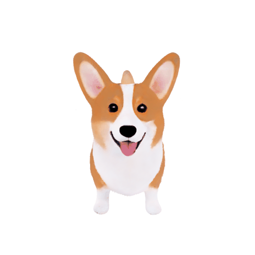</td>
  <td width=20% align="center">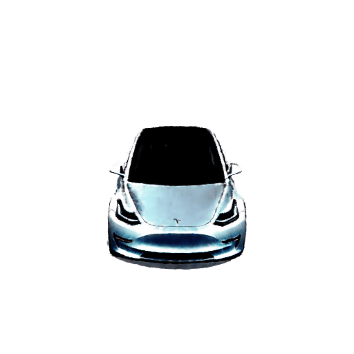</td>
  <td width=20% align="center"></td>
</tr>
<tr>
  <td width=20% align="center">"Spider Man"</td>
  <td width=20% align="center">"A wizard"</td>
  <td width=20% align="center">"A corgi"</td>
  <td width=20% align="center">"A Tesla Model3 sedan"</td>
  <td width=20% align="center">"A classic Packard car"</td>
</tr>
<tr>
  <td width=20% align="center"></td>
  <td width=20% align="center">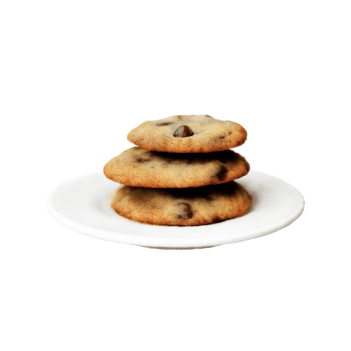</td>
  <td width=20% align="center">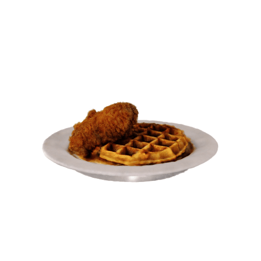</td>
  <td width=20% align="center">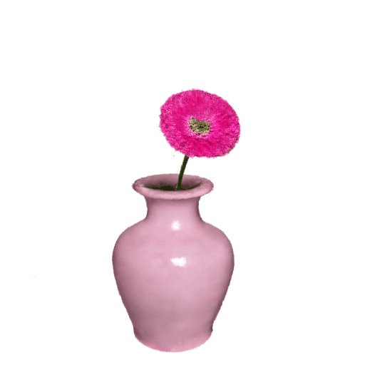</td>
  <td width=20% align="center">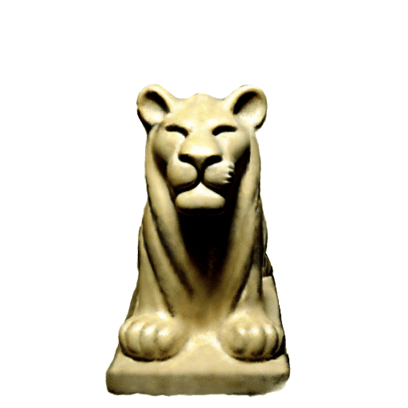</td>
</tr>
<tr>
  <td width=20% align="center">"A teddy bear"</td>
  <td width=20% align="center">"A plate piled high with chocolate chip cookies"</td>
  <td width=20% align="center">"A plate of fried chicken and waffles with maple syrup on them"</td>
  <td width=20% align="center">"A vase with pink flowers"</td>
  <td width=20% align="center">"a ceramic lion"</td>
</tr>
<tr>
  <td width=20% align="center"></td>
  <td width=20% align="center">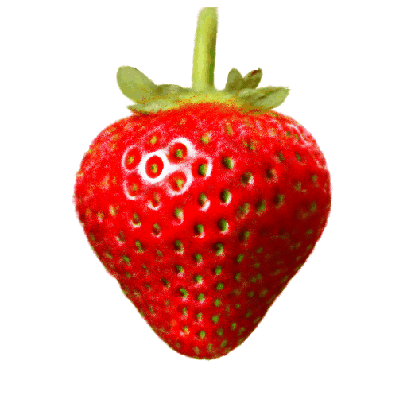</td>
  <td width=20% align="center">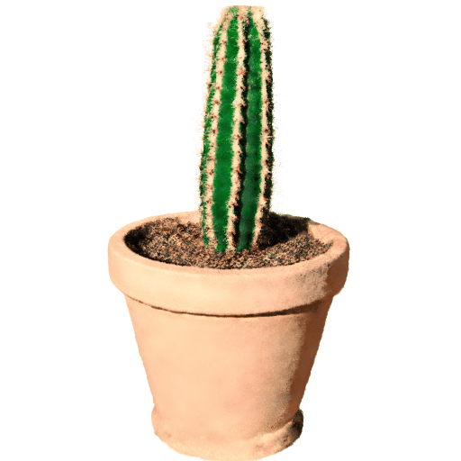</td>
  <td width=20% align="center">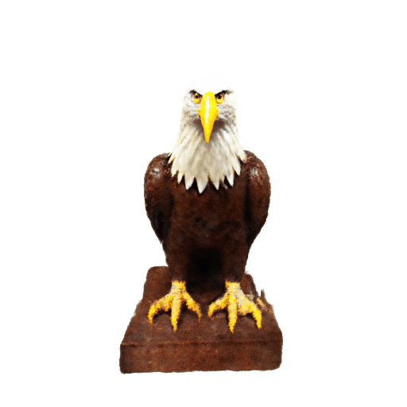</td>
  <td width=20% align="center">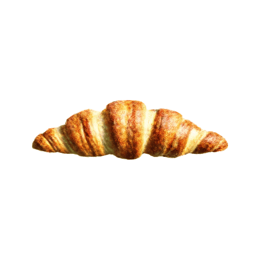</td>
</tr>
<tr>
  <td width=20% align="center">"A plush dragon toy"</td>
  <td width=20% align="center">"a ripe strawberry"</td>
  <td width=20% align="center">"a small saguaro cactus planted in a clay pot"</td>
  <td width=20% align="center">"a bald eagle carved out of wood"</td>
  <td width=20% align="center">"A delicious croissant"</td>
</tr>
<tr>
  <td width=20% align="center">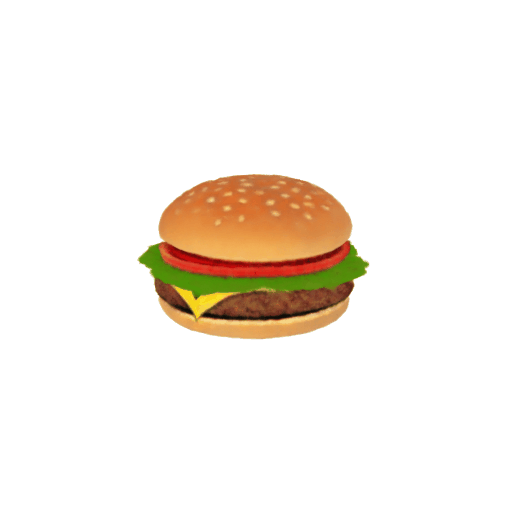</td>
  <td width=20% align="center">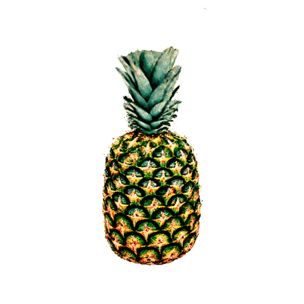</td>
  <td width=20% align="center">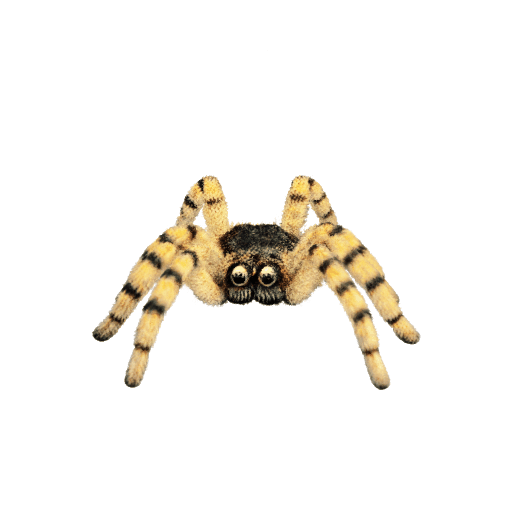</td>
  <td width=20% align="center">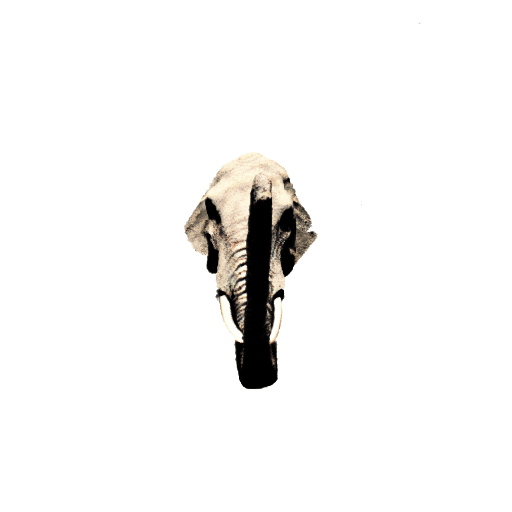</td>
  <td width=20% align="center">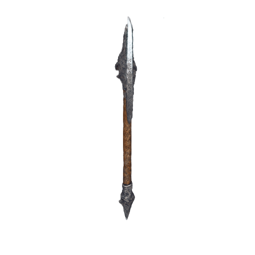</td>
</tr>
<tr>
  <td width=20% align="center">"a hamburger"</td>
  <td width=20% align="center">"A pineapple"</td>
  <td width=20% align="center">"A tarantula, highly detailed"</td>
  <td width=20% align="center">"An elephant skull"</td>
  <td width=20% align="center">"Viking axe, fantasy, weapon, blender, 8k, HD"</td>
</tr>
</table>

